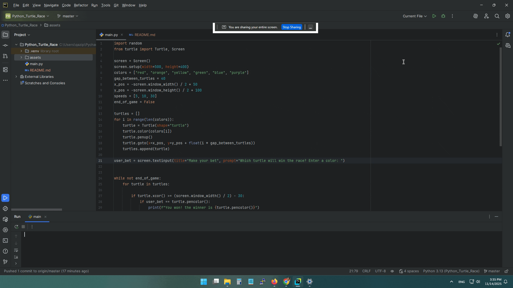

# 🐢 Python Turtle Race

A fun and interactive Python project using the built-in **turtle** module, where colorful turtles race across the screen until one randomly wins. This is a great beginner-friendly project for learning loops, graphics, and Python basics.

---

## 🎮 Features
- Multiple colored turtles racing across a track  
- Randomized movement for unpredictable outcomes  
- Simple user input (optional betting system)  
- Fully built with Python’s built-in **turtle** and **random** modules 
- Beginner-friendly and easy to modify  

---

## 📂 Project Structure
```
Python_Turtle_Race/
│
├── assets
│    └── race_preview.gif   
├── main.py
└── README.md
```

---

## 🚀 Getting Started

### ✅ Requirements
- Python 3.x installed on your system

1. Clone the repository:
   ```bash
   git clone https://github.com/qazipoor/Python_Turtle_Race.git
   ```
2. Navigate to the project folder:
   ```bash
   cd Python_Turtle_Race
   ```
3. Run the script:
   ```bash
   python main.py
   ```

---

## 🛠 Requirements
No external libraries — everything runs using Python’s built‑in **turtle** and **random** modules.

---

## 📸 Demo
Preview:




---

## 📝 License
This project is licensed under the **MIT License**. You are free to use, modify, and distribute it.

---
